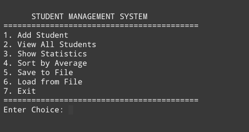
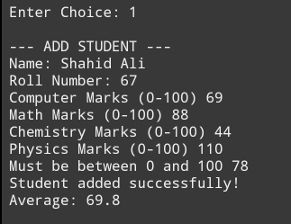
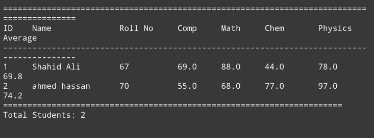

## Student Management System (C++)

# CloudExify C++ Internship – Project 2

A console-based Student Management System developed in C++. The application allows users to manage student records, calculate averages, display class statistics, sort records by average, and store data permanently using file handling.

---

## Developer Information

Name: Shahid Ali

Registration Number: CX-INT-2026-CPP-0361

---

## Features

-  Add new student records
-  View all student records in a formatted table
-  Calculate and display class statistics
-  Display topper and lowest-scoring student
-  Sort students by average using Bubble Sort
-  Save records to a text file
-  Load records from a text file
-  Input validation for marks
-  Modular code using separate functions

---

## Technologies Used

- C++
- Structures
- Arrays
- Functions
- File Handling ("fstream")
- Bubble Sort
- Console Application

---

## Project Structure

Student-Management-System/
│── CloudExify Project 2.cpp
│── students.txt
│── README.md
└── screenshots/
    ├── Screenshot_20260802-231504_1.jpg
    ├── Screenshot_20260802-231548_1.jpg
    └── Screenshot_20260802-231705_1.jpg

---

## How to Run

Using g++

Clone the repository

git clone https://github.com/shahidali567/CloudExify-cpp-P2-ShahidAli.git

Open the project folder

cd CloudExify-cpp-P2-ShahidAli

Compile the program

g++ "CloudExify Project 2.cpp" -o student_system

Run the executable

Windows

student_system.exe

Linux/macOS

./student_system

---

## Program Workflow

1. Run the program.
2. Choose an option from the main menu.
3. Add student details and marks.
4. View all student records.
5. Display class statistics.
6. Sort students by average.
7. Save or load records using file handling.
8. Exit the program.

---

## ScreenShots

## Menu

## Add Student

## Show All Students

## Concepts Used

- Structures
- Arrays
- Functions
- Loops
- Switch Case
- Bubble Sort
- File Handling
- Input Validation

---

## Author

Shahid Ali

BS Software Engineering

COMSATS University Islamabad, Wah Campus

CloudExify C++ Internship
